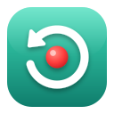

<p align="center">
  
</p>

<h1 align="center">Catchback</h1>

Replay buffer e gravador de tela para Linux, feito para registrar aquele momento raro (um shiny, um drop, uma captura) **depois** que ele acontece, sem precisar lembrar de apertar "gravar" antes.

Interface em GTK4 + libadwaita, captura via PipeWire/xdg-desktop-portal e codificação com GStreamer.

## Modos

- **Replay**: mantém sempre os últimos N minutos (padrão: 10) da tela ou de uma janela. Ao ver algo digno de clip, clique em **Salvar últimos 2 min** e o trecho é salvo sem reencodar.
- **Gravação**: grava um único arquivo até você parar, como a gravação de tela do GNOME.

## Formatos e qualidade

| Formato | Codec  | Observação                                   |
|---------|--------|----------------------------------------------|
| MP4     | H.264  | Padrão. Aceito em Discord, navegadores, redes |
| MKV     | H.264  | Mais robusto contra travamentos               |
| WebM    | VP9    | Mais pesado para codificar                    |

| Qualidade           | Bitrate |
|---------------------|---------|
| Leve                | 8 Mbps  |
| **Alta** (padrão)   | 20 Mbps |
| Máxima              | 50 Mbps |

> A codificação é feita em software (x264/VP9). Em 1080p60 a qualidade Máxima e o VP9 exigem bastante da CPU; se o vídeo falhar, use Alta ou Leve.

## Áudio

Na janela principal, o painel **Ajustar o áudio** tem uma chave por fonte, e o resumo **"O que entra no clip"** logo acima diz o que será gravado, o que você decide ao salvar e o que fica de fora. O padrão é sem áudio: o microfone e a call só gravam se você ligar.

| Fonte               | O que é                                                                          |
|---------------------|----------------------------------------------------------------------------------|
| **Som do jogo**     | O áudio de um aplicativo (o próprio jogo, escolhido ali mesmo) ou "tudo que toca no computador" |
| **Seu microfone**   | A sua voz, com escolha do dispositivo e teste de nível                           |
| **Call dos amigos** | As vozes do Discord e de outros apps de voz, como uma fonte à parte              |
| **Música e outros** | Spotify, YouTube etc.: você decide ao salvar (veja abaixo)                       |

Cada fonte tem seu **volume na gravação** (0 a 200 %): o ganho é aplicado só no clip, sem mexer no volume que você ouve nem no microfone da call. As mudanças são salvas na hora.

**A call dos amigos** usa os fluxos dos apps de voz que estão abertos quando a captura começa; por isso, entre na call **antes** de iniciar o replay (o app avisa se não achar nenhum). Ela fica desligada por padrão, porque são as vozes de outras pessoas. Se você escolher "tudo que toca no computador", a call já vem junto, e a chave some.

### Microfone

Em **Microfone** você escolhe qual dispositivo gravar (o padrão do sistema ou outro, como o fone Bluetooth) e pode usar **Testar microfone**: ele grava 2 segundos e diz se o nível está bom, sem sinal ou **saturado**. Ao iniciar uma captura com microfone, o app também faz essa checagem em segundo plano e avisa se ele estiver saturado.

Se o clip sair só com ruído e estalos no modo jogo + microfone, quase sempre é o microfone do sistema estourado (ganho de entrada alto demais): ele soterra o som do jogo. Baixe o volume de entrada nas configurações de som ou escolha outro microfone. Fones Bluetooth costumam ficar sem microfone no perfil de música; troque para o perfil de chamada.

### Música tocando (Spotify, YouTube...)

Para clips (por exemplo, de react) em que música com direitos autorais não pode ir junto, o Catchback **detecta o que está tocando fora do jogo**: players que anunciam pelo MPRIS (Spotify, VLC, navegadores com YouTube, SoundCloud etc.) e qualquer outro aplicativo com áudio ativo. Chamadas de voz (Discord, Zoom, Teams...) não contam como música. Um aviso na janela mostra o que foi detectado.

- **Com um aplicativo escolhido** (ex.: o jogo) e "Perguntar sobre a música ao salvar" ligado, o Catchback grava o jogo, o sistema, a call (se ligada) e o microfone em **faixas separadas**. Ao salvar, se algo tocou naquele trecho, ele pergunta **"Manter a música?"**:
  - *Sem a música*: o jogo, a call (se ligada) e o microfone.
  - *Manter*: todo o áudio do sistema (jogo, música e a call) e o microfone.
  O vídeo não é reprocessado; só o áudio é refeito, e o arquivo final tem uma única faixa de áudio. Se nada foi detectado, sai sem a música.
- **Sem aplicativo escolhido** (áudio do sistema) não há como separar a música: tudo que estiver tocando é gravado, e o aviso diz isso.

> A detecção sabe o que está tocando, não o que tem direitos autorais, e só enxerga players que usam o MPRIS ou que aparecem como fluxo de áudio. Ela reduz o risco, mas não o elimina: confira o clip antes de publicar.

O áudio vai em AAC (MP4/MKV) ou Opus (WebM). Se o jogo fechar no meio da gravação, o vídeo continua e o áudio segue em silêncio. Se o jogo for reaberto, ele ganha um novo fluxo de áudio e só volta a ser gravado na próxima captura.

## Requisitos

- Linux com **Wayland** ou X11 e `xdg-desktop-portal` (testado no GNOME/Wayland)
- Rust (edição 2024), via [rustup](https://rustup.rs)
- GTK 4 e libadwaita (com cabeçalhos de desenvolvimento)
- GStreamer com os plugins `base`, `good`, `bad` e `ugly`, mais o plugin do PipeWire
- `ffmpeg` (usado para juntar os segmentos do replay)
- `pactl` (`libpulse`) **ou** `pw-dump` (`pipewire`), opcionais: só servem para listar os aplicativos que tocam áudio. Sem nenhum dos dois, o app avisa e só o áudio do sistema fica disponível

No Arch/Manjaro:

```sh
sudo pacman -S --needed rust gtk4 libadwaita ffmpeg xdg-desktop-portal \
    gstreamer gst-plugins-base gst-plugins-good gst-plugins-bad gst-plugins-ugly \
    gst-plugin-pipewire
```

## Instalação

```sh
./install.sh
```

Compila em modo release e instala em `~/.local`: o binário (`bin/catchback`), o **atalho no menu de aplicativos** (`Catchback`, com o ícone de replay) e o ícone. Depois é só abrir pelo menu do sistema. Na primeira vez o GNOME pode levar alguns segundos para mostrar o atalho; se não aparecer, saia e entre na sessão de novo.

| Comando | O que faz |
|---|---|
| `./install.sh --prefix /usr/local` | instala para todos os usuários (precisa de `sudo`) |
| `./install.sh --bin caminho/do/catchback` | usa um binário já compilado, sem rodar o `cargo` |
| `./install.sh --uninstall` | remove o binário, o atalho e o ícone |

O arquivo `data/dev.catchback.Catchback.desktop` tem o mesmo nome do ID do aplicativo, que é o que o Wayland usa para ligar a janela ao ícone certo. Se você instalar por fora do script, copie o `.desktop` para `share/applications` e o SVG de `data/icons` para `share/icons`.

## Como usar

Sem instalar, para testar direto do código:

```sh
cargo run --release
```

1. Escolha **Replay** ou **Gravação**.
2. Clique em iniciar e escolha a tela ou a janela no diálogo do sistema.
3. No replay, clique em **Salvar últimos X min** quando quiser guardar o momento. Na gravação, clique em **Parar**.

Os clips vão para `~/Vídeos/Catchback` (a pasta de vídeos do seu usuário). Tudo pode ser ajustado em **Preferências** (`Ctrl+,`): duração do buffer, duração do clip, FPS, qualidade, formato e pasta de saída.

A configuração fica em `~/.config/catchback/config.toml`:

```toml
buffer_minutes = 10   # janela do replay (1 a 60)
clip_seconds = 120    # quanto o botão "salvar" recupera (5 a 3600)
fps = 60
container = "mp4"     # mp4 | mkv | webm
quality = "high"      # light | high | max
audio = "off"         # off | game | game_and_mic | mic (o que as chaves do jogo e do microfone gravam)
ask_music = true      # com app escolhido: faixas separadas e pergunta ao salvar
mic_source = "nome"   # opcional: microfone (sem isso, o padrão do sistema)
audio_app = "nome"    # opcional: app cujo som é gravado (sem isso, áudio do sistema)
record_call = false   # grava também a call (Discord etc.)
game_volume = 100     # ganho do jogo na gravação, em % (0 a 200)
call_volume = 100     # ganho da call na gravação, em % (0 a 200)
mic_volume = 100      # ganho do microfone na gravação, em % (0 a 200)
output_dir = "/home/usuario/Vídeos/Catchback"
```

## Como funciona

No replay, o GStreamer grava segmentos de 5 s em `~/.cache/catchback/segments` (em disco, não em RAM). Um buffer circular descarta os mais antigos além da janela. Ao salvar, o segmento atual é fechado e os últimos segmentos são juntados com `ffmpeg -c copy`, por isso o clip sai quase instantaneamente e sem perda de qualidade.

O **vídeo pode perder quadros, o áudio nunca**: se o computador não acompanhar a codificação (comum em 1080p60 com o `x264` em software), o vídeo descarta quadros antes do encoder e o áudio segue contínuo, em filas separadas. Se isso acontecer com frequência, baixe o FPS ou a qualidade.

Como no Wayland a fonte só entrega quadros quando a tela muda, o último quadro é reenviado periodicamente (`keepalive-time`), para que uma tela parada também gere vídeo.

## Estrutura

O núcleo é independente da interface e testável:

| Módulo        | Responsabilidade                                               |
|---------------|----------------------------------------------------------------|
| `buffer`      | Buffer circular de segmentos e seleção dos últimos N segundos  |
| `config`      | Configuração em TOML, validação e caminhos XDG                 |
| `session`     | Máquina de estados (parado, gravando, replay)                  |
| `format`      | Contêineres, codecs e perfis de qualidade                      |
| `capture`     | Descrição dos pipelines GStreamer                              |
| `clip`        | Nomes de arquivo e comando do ffmpeg                           |
| `recorder`    | Orquestra tudo atrás de traits (backend e exportador)          |
| `gst`, `ffmpeg`, `portal` | Implementações reais: GStreamer, ffmpeg e portal   |
| `audio`       | Modos de áudio, apps tocando (`pactl`/`pw-dump`), faixas e mixagem |
| `mic`         | Lista de microfones, teste de nível e detecção de saturação     |
| `music`       | Detecção de música (MPRIS + fluxos ativos) e histórico do trecho |
| `labels`      | Textos da interface                                            |

Fora do código: `data/` guarda o atalho (`.desktop`) e o ícone (SVG), e `install.sh` instala tudo.

## Conferir a interface

`CATCHBACK_SNAPSHOT_DIR=/tmp/capturas cargo run` abre o app, percorre alguns cenários (painel de áudio aberto, aviso de música, menus) e salva capturas da própria janela em PNG, usando uma configuração separada que não mexe na sua.

## Testes

```sh
cargo test
```

Os testes de unidade cobrem o núcleo. Há também testes de integração com o GStreamer e o `ffmpeg` reais, que usam uma fonte de teste no lugar do PipeWire e conferem os arquivos gerados em todos os formatos. Se o GStreamer ou o `ffmpeg` não estiverem disponíveis, esses testes são ignorados.

`tests/desktop_entry.rs` confere o atalho e o ícone (campos obrigatórios, validação com `desktop-file-validate`, renderização do SVG) e roda o instalador num diretório temporário, instalando e desinstalando.

## Limitações e próximos passos

- O áudio de um app é ligado ao fluxo que existia ao iniciar; se o app reabrir, só vale na próxima captura.
- Codificação apenas por software; encoder por hardware (VA-API) é o próximo passo natural.
- A seleção da tela/janela é pedida a cada início de captura.
- Detecção automática de shiny ou raridade está fora do escopo, pois exigiria analisar a tela quadro a quadro.
